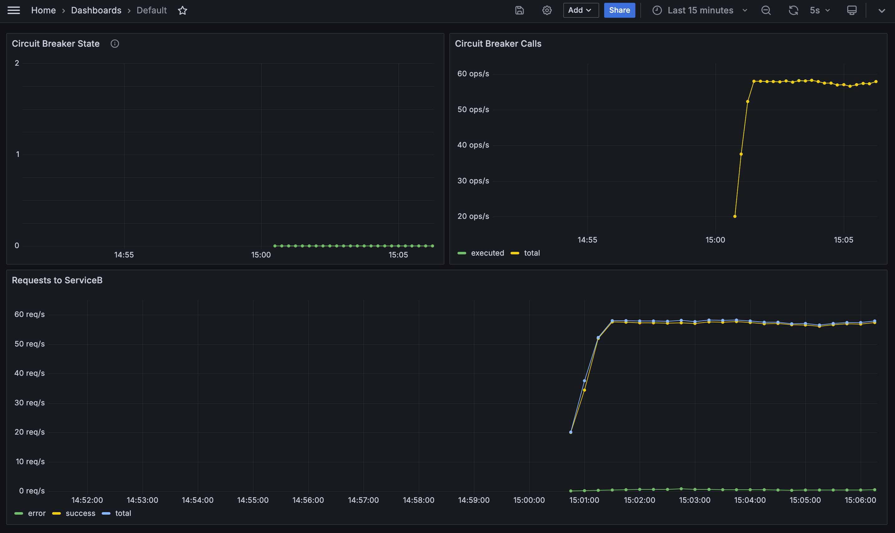
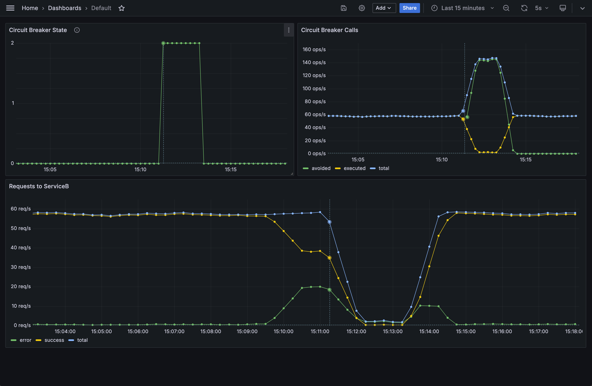

# Circuit Breaker

## Introduction

In distributed systems, services often depend on each other to function correctly. However, if one service becomes unresponsive or starts failing, it can cause a ripple effect, leading to system-wide issues.
To mitigate this, the **Circuit Breaker** pattern is employed. It acts as a safeguard, preventing a failing service from being called repeatedly, allowing it time to recover and ensuring the overall system remains stable.

## Project Overview

This project demonstrates a practical implementation of the Circuit Breaker pattern using two services:

- **Service A**: Acts as the primary service that makes requests to Service B.
- **Service B**: The secondary service that Service A depends on.

Additionally, the project integrates monitoring tools to observe and analyze the behavior of the services and the circuit breaker mechanism:

- **Prometheus**: Collects real-time metrics from the services.
- **Grafana**: Provides dashboards for visualizing the metrics collected by Prometheus.

## Prerequisites

Ensure you have the following installed:

- [Docker](https://www.docker.com/get-started)

## Getting Started

1. **Clone the Repository**:

```bash
git clone https://github.com/pcandido/circuit-breaker.git
cd circuit-breaker
```

2. **Start the Services**:

Use Docker Compose to build and start all services:

```bash
docker-compose up --build
```

3. **Observe the Circuit Breaker in action**:

* Browse to Grafana at [http://localhost:3000](http://localhost:3000).
* The default user is `admin` and the default password is `admin`.
* Browse to the Default Dashboard.



4. **Change Service B params**:

Change Service B params to provoque a fail and see the Circuit Breaker in action

* Browse to the Service B Control Panel at [http://localhost:8080/](http://localhost:8080/).
* Modify the success rate and latency to cause failures.
* Observe the impact on Grafana.



## Conclusions

The last picture clearly illustrates the effect of the circuit breaker.
Before it becomes open, the error rate increases but does not cross the threshold.
Moments later, the error rate spikes, triggering the open mechanism of the circuit breaker.
Instead of allowing the error rate to continue rising, the open circuit breaker relieves the stress on Service B, allowing only a few requests to check the service's status.

As a result, the throughput over Service B decreases from 60 requests per second (rps) to 2 rps (considering the rate[1m] of Grafana).
Eventually, when Service B becomes available again, the circuit transitions from half-open to closed, and normal operation resumes.

During the problem period, the number of Circuit Breaker Calls increased. Why?
This is because the circuit breaker follows the principle of "fail fast".
When avoiding calls to Service B due to its unavailability, the system responds quickly without making the external request, which is faster than waiting for a failed request.
As we simulate the load using a loop, it is expected that more requests can be processed without waiting for Service B.

In summary, the circuit breaker effectively mitigates the impact of failures in Service B, ensuring the stability and resilience of the overall system.
